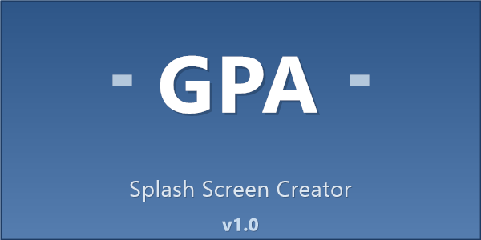

# Professional Splash Screen Creator

A comprehensive PowerShell tool for creating professional splash screen images and Windows icons with customizable text, colors, and styling. Features both command-line and GUI interfaces for maximum flexibility.



## Features

### GUI Interface
- **Real-time Preview**: See changes instantly as you type
- **Intuitive Layout**: Left panel for controls, right panel for preview
- **Professional Design**: Clean, modern interface with proper spacing
- **Tabbed Interface**: Creator, Help, and About tabs for organized workflow
- **Startup Splash Screen**: Professional branding on application launch

### Easy Configuration
- **Text Fields**: Main text, subtitle, and version with live preview
- **Dimension Controls**: Width and height with numeric spinners (200-2000px width, 100-1000px height)
- **Color Schemes**: Dropdown with 5 professional themes
- **Output Path**: Text field with browse button for easy file selection

### File Management
- **Save/Load Configurations**: JSON-based configuration files for reuse
- **Multiple Formats**: PNG, JPG, BMP, ICO support with automatic format detection
- **Browse Dialog**: Easy file selection with proper filters

### Real-time Features
- **Live Preview**: Updates automatically as you change settings
- **Responsive Scaling**: Preview scales to fit while maintaining aspect ratio
- **High Quality**: Anti-aliased rendering with professional effects

## Quick Start

### GUI Interface (Recommended)
1. **Double-click**: `Launch-SplashScreenCreator-GUI.bat`
2. **Or run directly**: `SplashScreenCreatorGUI.ps1` in PowerShell

### Command Line Interface
```powershell
# Basic splash screen
.\SplashScreenCreator.ps1 -MainText "GPA" -SubtitleText "Enhanced Backup Manager" -VersionText "V2"

# Create Windows icon
.\SplashScreenCreator.ps1 -MainText "GPA" -CreateIcon -OutputPath "MyApp.ico"

# Custom dimensions and colors
.\SplashScreenCreator.ps1 -Width 800 -Height 400 -ColorScheme "Modern" -OutputPath "MyApp.png"
```

## Color Schemes

- **Professional**: Blue gradient, perfect for business applications
- **Corporate**: Dark gradient, sophisticated and professional
- **Modern**: Bright blue, contemporary and clean design
- **Green**: Eco-friendly theme, great for environmental apps
- **Red**: Bold and attention-grabbing design

## Output Modes

### Splash Screen Mode (Default)
Creates rectangular images perfect for application splash screens:
- **Formats**: PNG, JPG, BMP
- **Dimensions**: Customizable width and height
- **Use Cases**: Application startup screens, loading screens, banners

### Icon Mode (-CreateIcon)
Creates Windows icon files with multiple resolutions:
- **Format**: ICO (Windows Icon)
- **Sizes**: Multiple resolutions in one file (16x16 to 256x256)
- **Use Cases**: Application icons, file type icons, system tray icons

## Configuration Files

Create a JSON file to store your splash screen settings:

```json
{
    "MainText": "ACME Corp",
    "SubtitleText": "Business Management Suite",
    "VersionText": "V3.0",
    "Width": 600,
    "Height": 300,
    "ColorScheme": "Corporate",
    "OutputPath": "ACME-Splash.png"
}
```

Then use it:
```powershell
.\SplashScreenCreator.ps1 -ConfigFile "my-config.json"
```

## Examples

### Create Company Splash Screen
```powershell
.\SplashScreenCreator.ps1 -MainText "ACME" -SubtitleText "Business Suite" -VersionText "V3.0" -ColorScheme "Corporate"
```

### Application Icon (Standard Sizes)
```powershell
.\SplashScreenCreator.ps1 -MainText "GPA" -CreateIcon -OutputPath "MyApp.ico"
```

### Large Format Splash Screen
```powershell
.\SplashScreenCreator.ps1 -Width 1024 -Height 512 -MainText "MyApp" -ColorScheme "Modern" -ShowPreview
```

## Installation

1. **Download** or clone this repository
2. **Ensure PowerShell execution policy** allows script execution:
   ```powershell
   Set-ExecutionPolicy -ExecutionPolicy RemoteSigned -Scope CurrentUser
   ```
3. **Run the GUI**: Double-click `Launch-SplashScreenCreator-GUI.bat`
4. **Or use command line**: Run `SplashScreenCreator.ps1` with your desired parameters

## System Requirements

- **Operating System**: Windows 7 or later
- **PowerShell**: Version 5.1 or later
- **.NET Framework**: 4.5 or later (for Windows Forms)
- **Memory**: 100MB+ available RAM
- **Disk Space**: Minimal (output files vary by dimensions)

## Files in This Repository

- `SplashScreenCreatorGUI.ps1` - GUI interface with splash screen, Help, and About tabs
- `SplashScreenCreator.ps1` - Command-line version for automation
- `Launch-SplashScreenCreator-GUI.bat` - Easy launcher for GUI
- `SplashScreenCreator-GUI-README.md` - Detailed GUI documentation
- `SplashScreenCreator-README.md` - Detailed command-line documentation
- `SplashScreen.png` - Sample output image

## Tips for Best Results

### Text Guidelines
- **Keep main text short**: 1-4 characters work best (e.g., "GPA", "ACME")
- **Descriptive subtitles**: Explain what the application does
- **Clear versioning**: Use standard formats like "V1.0", "Version 2.3"

### Dimension Recommendations
- **Dialog splash screens**: 400x200 to 500x250
- **Desktop applications**: 600x300 to 800x400
- **Large displays**: 1000x500 or larger
- **Mobile/compact**: 300x150 to 400x200

### File Format Choice
- **PNG**: Best quality, supports transparency (recommended)
- **JPG**: Smaller file size, good for web use
- **BMP**: Uncompressed, largest file size
- **ICO**: Windows icon format with multiple resolutions

## Contributing

Feel free to submit issues, feature requests, or pull requests to improve this tool.

## License

Free for personal and commercial use.

## Author

Created by **Gianpaolo Albanese**  
Enhanced with **AI Assistant (Kiro)**  
Date: December 23, 2025  
Version 1.0

---

⭐ **Star this repository** if you find it useful!